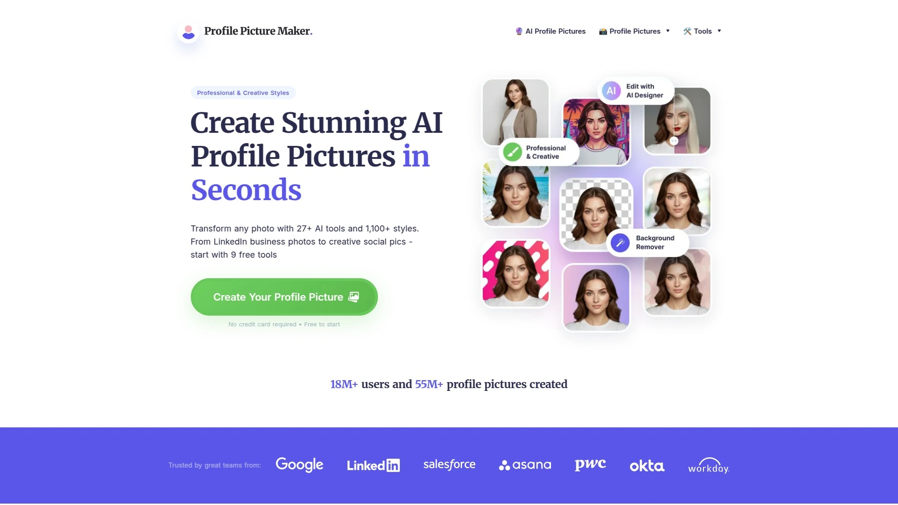

# 15个免费AI照片生成平台:想要专业人像照,一键即可搞定!

你是不是也遇到过这样的情况:需要一张职业照发LinkedIn,翻了半天相册找不到一张能看的;想拍组创意写真,摄影师报价一开口就是四位数起步。其实现在有个更省事的办法——AI照片生成工具。上传几张自拍,AI就能帮你"拍"出各种风格的专业照片,从商务头像到时尚大片,几分钟搞定。这篇文章整理了15个好用的平台,覆盖专业头像、创意写真、虚拟模特等各种场景,让你不用出门就能拥有影棚级别的照片。

## **[PhotoAI](https://photoai.com)**

全球首个AI摄影师,把你变成AI模特后随时随地拍大片。

PhotoAI最大的特点是能把你训练成一个专属AI模特,之后想拍什么风格的照片都能在几十秒内生成。它不仅能做静态照片,还能把照片转成短视频,甚至让你的AI模特"开口说话"。上传10到20张不同场景的自拍照片,系统就会训练出一个高度还原你本人的数字模型。训练完成后,你可以使用平台内置的各种主题照片包——从巴黎街头到巴厘岛海滩,从商务正装到万圣节造型,一键生成整套写真。

这个平台还有个很实用的功能叫虚拟试衣,把淘宝或Zara的衣服截图粘贴进去,AI就能让你的模特穿上它,特别适合电商卖家测试产品照效果。如果你想做产品营销视频,还可以让AI模特拿着你的产品拍摄TikTok风格的推广短片,省去了雇真人模特的麻烦和费用。PhotoAI的照片真实度非常高,远景特写都能驾驭,甚至支持微距摄影效果。定价方面提供月付和年付套餐,基础版每月19美元,专业版49美元,年付有较大折扣。

## **[Aragon AI](https://www.aragon.ai)**

专为商务人士设计的AI头像生成器,上传12-20张照片就能获得40多张高清职业照。

Aragon非常适合需要统一团队形象的企业,或者急需职业照但没时间去影楼的职场人。它的算法专注于商务场景,生成的照片光线自然、背景专业,完全符合LinkedIn或公司官网的标准。你只需要上传12到20张日常照片——不需要特别准备,手机自拍就行——系统会自动分析你的面部特征,然后生成多种风格的职业照。

输出结果包括不同背景、不同服装、不同光线效果的版本,总共40多张高清照片供你挑选。整个过程大约需要一小时,比预约摄影师、化妆、拍摄、修图这一整套流程快多了。价格从12美元起步,分基础版、标准版和高级版三个档次,高级版提供更多照片选择和更精细的细节处理。

## **[HeadshotPro](https://www.headshotpro.com)**

远程团队的最佳选择,专注生成一致性强的团队职业照。

如果你们公司是远程办公,团队成员分散在各地,想要统一风格的员工照片就很麻烦。HeadshotPro就是解决这个问题的——每个人各自上传8到20张照片,系统会生成120多张统一风格的职业照,保证团队页面看起来协调一致。这个工具被很多500强企业使用,因为它能快速为大规模团队提供标准化的形象照。

生成的照片质量很稳定,面部细节清晰,背景简洁专业,符合企业品牌调性。定价也是按照基础、专业、高级三个版本,分别是29美元、39美元和59美元,适合不同预算的团队需求。

## **[Midjourney](https://www.midjourney.com)**

AI艺术圈的王者,以电影级画质和艺术风格著称。

Midjourney在AI图像生成领域几乎是神一样的存在,特别受AI电影制作人和艺术创作者欢迎。它生成的照片具有极强的电影感和艺术性,几乎看不出是AI生成的。虽然最初是基于Discord运行,但现在已经推出了更友好的网页版界面。

这个工具的强项在于它能理解复杂的艺术概念,支持角色一致性、风格参考、图像参考等高级功能,还有强大的编辑能力。无论你想要写实风格、油画质感还是赛博朋克美学,Midjourney都能精准呈现。唯一的小缺点是没有免费版本,但考虑到它的输出质量,定价还算合理。它特别适合需要高度艺术化视觉效果的创意项目。

## **[Leonardo AI](https://leonardo.ai)**

免费好用的文字转图像工具,提供多种预训练模型适配不同艺术风格。

Leonardo AI最吸引人的地方是它的免费计划功能已经很强大,而且操作简单。平台提供了7种预训练模型,涵盖动漫、写实、概念艺术等各种风格,你可以根据项目需求快速切换。它的实时画布功能让你能边调整边看效果,大大提高了创作效率。

除了基础的图像生成,Leonardo还提供实时生成、画布编辑器、通用放大器等工具,能对生成的图像进行精细调整。无论是游戏设计师需要概念图,还是自媒体人需要配图,Leonardo都能快速产出高质量素材。移动端也有iOS和Android应用,随时随地都能创作。

## **[Stable Diffusion](https://stablediffusionweb.com)**

开源免费的图像生成模型,适合喜欢本地部署和深度定制的用户。

Stable Diffusion是开源社区的宠儿,完全免费且功能强大。它允许你在自己电脑上本地运行,不需要担心隐私泄露或者使用次数限制。对于技术型用户来说,Stable Diffusion提供了无限的可能性——你可以训练自己的模型,调整参数,甚至开发插件。

在线版本也很方便,界面简洁,输入文字描述就能快速生成图像。它不收集任何个人信息,也不存储你的文字或图片,隐私保护做得很到位。虽然上手需要一定学习曲线,但社区资源丰富,有大量教程和预设模板可以参考。

## **[Remini](https://remini.ai)**

老照片修复神器,一键将模糊照片变成高清大片。

Remini的核心功能是照片增强和修复,特别擅长处理老照片、模糊照片和低分辨率图像。如果你手机里有很多画质不太好的照片,或者家里有泛黄的旧照片想要数字化保存,Remini能帮你把它们变成高清版本。它使用先进的AI技术重建图像细节,效果非常惊人。

应用已经被下载超过5亿次,帮助修复了超过1亿张照片。操作非常简单,上传照片一键点击就能看到效果。除了修复功能,Remini还能生成专业级AI照片,把普通自拍转化成影棚质感的人像。应用同时支持iOS和Android,随时可以处理照片。

## **[Lensa AI](https://lensa.app)**

魔法头像功能爆火,能把自拍变成各种艺术风格的虚拟形象。

Lensa AI因为它的Magic Avatars功能在社交媒体上爆红。你只需要上传10到20张自拍,选择喜欢的艺术风格——从幻想风、动漫风到艺术风——系统就会生成一套完整的虚拟头像。这些头像不是简单的滤镜效果,而是AI重新创作的艺术作品,每一张都独一无二。

除了头像生成,Lensa本身也是个功能齐全的照片编辑器,提供背景模糊、一键美颜、魔法修正等工具。最近还推出了情侣头像功能,只需一张合照就能快速生成配对头像。应用提供7天免费试用,之后有多种订阅选项可选。

## **[Fotor](https://www.fotor.com)**

在线照片编辑平台,内置强大的AI头像生成器。

Fotor是个老牌在线设计工具,近年加入了很多AI功能。它的AI头像生成器操作特别简单——上传4到10张自拍,选择想要的风格,几秒钟就能得到专业头像。生成的照片适合用在LinkedIn、简历、社交媒体等各种场合。

平台还提供背景移除、AI艺术生成、服装试穿等附加功能,算是一个综合性的图像处理工作站。基础功能免费,高级功能订阅价格从每月8.99美元起,性价比不错。网页版和移动应用都很好用,可以跨设备同步项目。

## **[Canva](https://www.canva.com)**

设计平台中的多面手,AI头像功能融合在强大的设计生态里。

Canva大家应该都不陌生,它最近也加入了AI头像生成功能。相比其他专注于照片生成的工具,Canva的优势在于生成头像后可以直接在平台内进行设计应用——做名片、做海报、做社交媒体配图,一气呵成。

它提供大量AI驱动的模板,还有品牌套件功能,能保持你所有设计素材的视觉统一。如果你本来就在用Canva做设计,那AI头像功能就是个锦上添花的工具。免费版功能有限,专业版每年120美元,团队版每年100美元。

## **[MyEdit](https://www.cyberlink.com)**

每天提供3次免费额度,快速生成专业头像的轻量级工具。

MyEdit的最大卖点是慷慨的免费政策——每天3次免费生成额度,对于偶尔需要头像的用户来说完全够用。只需上传一张照片就能生成几十张AI头像,可以选择8种不同的风格或背景,输出选项有20张、40张或80张。

测试下来,生成的照片和原照相似度很高,即使只上传一张照片作为训练素材,效果也不错。大约10分钟就能拿到结果,速度很快。付费订阅从4美元起,价格非常亲民。除了头像生成,MyEdit还提供背景移除、AI艺术生成、虚拟试衣等额外工具。

## **[D-ID](https://www.d-id.com)**

2025年最佳AI虚拟形象生成器,能创建会说话会互动的数字人。

D-ID走的是更高端的路线,不只是生成静态照片,而是创建能够互动的数字人。你可以选择虚拟形象的外观、声音,甚至上传文档让它学习特定知识,几分钟内就能拥有一个可以对话的数字分身。这种技术特别适合做多语言视频、个性化营销、虚拟客服等应用。

平台提供实时视频创建功能,响应准确率超过90%,回复速度不到2秒。除了创建自己的数字人,D-ID还支持视频翻译和个性化视频活动。提供14天免费试用,付费套餐从每月5.90美元起。

## **[HeyGen](https://www.heygen.com)**

AI视频虚拟形象生成器,让静态照片变成会说话的动画角色。

HeyGen专注于视频场景的虚拟形象生成,它能把你的照片转化成会说话、有表情的动画角色。这个工具的AI文字转语音功能非常强大,能同步口型和面部表情,看起来就像真人在说话。你可以用它制作培训视频、产品介绍、社交媒体内容,不需要真人出镜。

平台提供多种模板和自定义场景选项,还有服装生成器可以给虚拟形象换装。免费版可以生成虚拟形象和1分钟视频,付费计划从每月24美元起。对于需要批量制作视频内容的创作者来说,HeyGen能大幅提升效率。

## **[Dreamwave](https://dreamwave.ai)**

用更少的照片生成更真实的商务头像,快速交付。

Dreamwave的特点是只需要5到8张输入照片就能生成40张高分辨率头像,对比其他工具要求的10到20张,上传门槛更低。生成的照片非常适合商务场景,光线自然,细节到位,交付速度也很快。

定价分为三档:入门版35美元、标准版59美元、超值版99美元,价格比一次专业摄影便宜得多。如果你需要快速获得专业头像又不想准备太多素材,Dreamwave是个不错的选择。

## **[PFPmaker AI](https://pfpmaker.com)**

秒速生成大量休闲风格虚拟形象,适合社交媒体使用。

PFPmaker AI走的是快速批量生成路线——上传一张照片,几秒钟就能获得数百张不同风格的AI虚拟形象。这些头像风格偏向休闲和创意,非常适合用在Discord、Twitter、Instagram等社交平台。

它不像其他工具那样专注于超写实效果,而是提供更多趣味性和艺术化的选择。价格从基础版15美元到高级版25美元,如果你需要快速获得大量社交媒体头像,这个工具效率最高。

## **[SynthLife](https://synthlife.co)**

创建、发布和规模化运营AI虚拟网红的完整平台。

SynthLife是专门为想要创建AI虚拟网红的人设计的。它不仅能生成照片和视频,还提供发布管理、内容排期等运营功能。一张照片就能启动一个虚拟创作者账号,生成短视频内容发布到Instagram、TikTok、YouTube,不需要影棚也不需要复杂剪辑。

平台工具包括图像克隆、视频克隆、换脸、场景编辑、画质提升等全套功能,还能从Instagram找灵感创作相似内容。对于想要进入虚拟网红领域的创作者来说,SynthLife把创作时间缩短了90%,大幅降低了入门门槛。注册不需要信用卡,可以先试用体验。

***

## 常见问题

**这些AI照片生成器适合什么人使用?**

职场人士可以用来快速获得LinkedIn职业照,自媒体创作者能批量产出内容配图,电商卖家能让AI模特展示产品,普通用户也能给自己拍创意写真。基本上任何需要照片但又不想花时间精力去拍摄的场景都适用。

**生成的照片真实度如何,会不会一眼看出是AI?**

头部平台像PhotoAI、Aragon、HeadshotPro生成的照片真实度已经非常高,特别是人像照片,细节到位光线自然,很难分辨。当然不同工具效果有差异,建议先用免费版或试用版测试一下,看是否满足你的需求。

**使用这些工具需要什么技术基础吗?**

完全不需要。大部分工具的操作流程就是上传照片、选择风格、等待生成,整个过程最多几分钟。像PhotoAI、MyEdit、Fotor这些平台的界面都很友好,第一次用也能轻松上手。

---

## 总结

如果你需要一个功能全面、能训练专属AI模特的平台,[PhotoAI](https://photoai.com)绝对是首选——它不仅能生成各种风格的照片,还支持视频制作和虚拟试衣,适合从个人创意到商业应用的各种场景。这15个工具各有侧重,职业照就找Aragon或HeadshotPro,艺术创作选Midjourney或Leonardo,修复老照片用Remini,做虚拟网红找SynthLife。选对工具,你的照片需求就能又快又好地解决。
